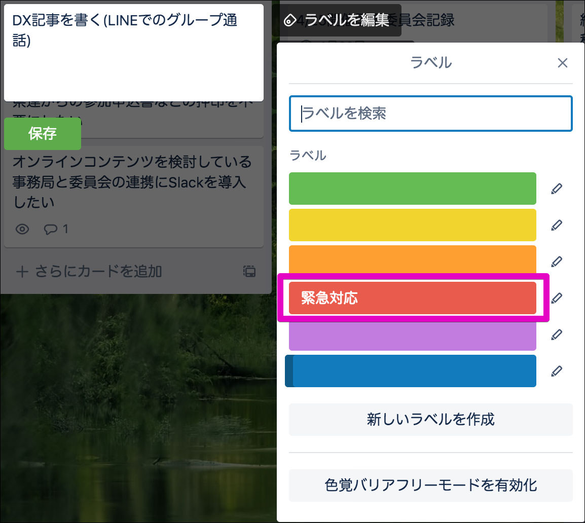
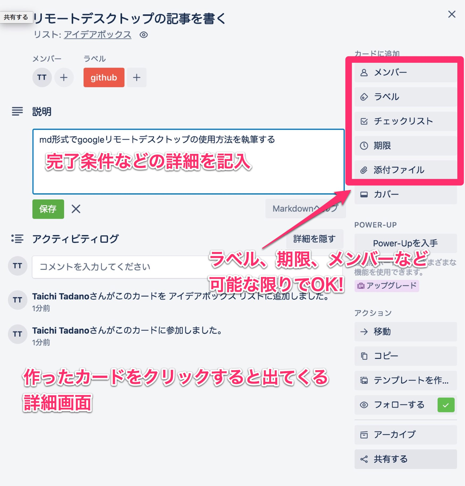

# タスク管理をtrelloで

## 目的
DX推進室の各メンバーが関係するタスクを「見える化」するため

## 運営ルール
[運営ルール](https://github.com/jt-t/saj-kanban-rules/wiki/DX%E6%8E%A8%E9%80%B2%E5%AE%A4%E3%82%BF%E3%82%B9%E3%82%AF%E7%AE%A1%E7%90%86%E3%83%AB%E3%83%BC%E3%83%AB%E6%A1%88)をご覧下さい

# 使い方を画面で解説

## トップ画面

ログインするとこのようになります。もし表れない場合は[SAJ DX推進室](https://trello.com/b/ZLnHBrP9)を選択してください。
3つのボードが設定済みで

* アイデアボックス
	* 誰でも登録できる「タスク生成所」
* 進行中
	* 担当者、内容、期限が明確になった「タスク」
* 完了
	* タスクの完了条件を満たしたもの。

## タスクの追加

[カードを追加]をクリックします

## タイトルを付ける

タイトルを「○○を××する」の形式で入力します。

## ラベルを付ける

タスクの視認性を付けるため、できればラベルを付けてください。[・・・]をクリックすると小窓が立ち上がるので[ラベル]をクリックします

## ラベルを選択

図のように予め設定してあるラベルを選択します。もし該当がなければ新しいラベルを付けることもできます。

## 詳細を入力

作ったカードをクリックするとこのような詳細画面になります。
* 説明
	* 完了条件などの詳細
* 右側項目
	* メンバー、期限など可能な限り入力してください(アイデア段階では不要ですが、進行中フェーズに移す際は必須です!)

## 担当者のアサイン(割り当て)

まだタスクに担当者が割り当てられていない、もしくは追加、変更するときに使用します。
作ったカードにマウスを乗せると、図のようなエンピツマークが出てきます。これをクリックします。

## 担当者のアサイン(割り当て) その2

サブメニューから[メンバーを変更]をクリックします。

## 担当者のアサイン(割り当て) その3

"ボードのメンバー"一覧から割り当てメンバーを選択すると、カードにアイコンが表示されます。

## アイデアボックスから進行中へ移動

担当者、内容、期限が決まったら「タスク化」の準備が整いました。タイトルをドラッグ&ドロップして[進行中]へ移動させましょう。

## アイデアボックスから進行中へ移動

再びホーム画面です。アイデアボックスには有象無象のタスク化前のものが、進行中には文字通り進行中のタスクがあり、視覚化できようになりました。

あとはこの繰り返しで、左から右へどんどん移動させていきましょう!